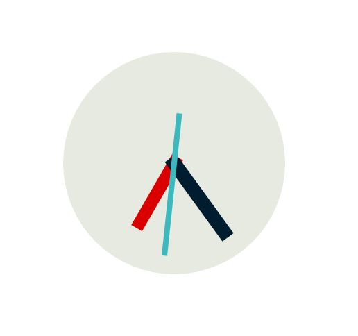

<h1 align="center">Relogio Material</h1>

Um [relógio] simples com visual analógico constituído de CSS.

O intuito deste site era apenas aprender o básico da biblioteca Moment.js e de Material Design, consequentemente aprimorando os conhecimentos de CSS. Qualquer comentário, elogio, sugestão ou crítica é muito bem-vindo.

  ## Funcionalidades
  * Exibe hora digitalmente
  * Exibe hora em um relógio "analógico" controlado por CSS e JS 
  * Exibe data
  
  ## Recursos
  - Biblioteca que manipula datas e horários usando JavaScript [Moment.js](https://momentjs.com/)
  - Depósito de componentes e ícones da Google para [Material Design](https://material.io/)
  - [Google Fonts](https://fonts.google.com/)
    - Font Family: Work Sans, sans-serif
  - Imagens Próprias  

# O Que Eu Aprendi
  - [X] Conceitos de Material Design
  - [X] Manipulação de CSS por JS
  - [X] Uso da biblioteca Moment.js